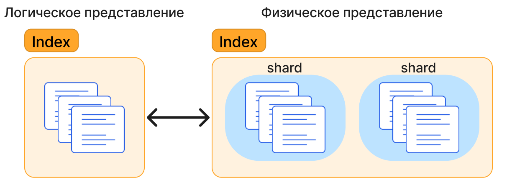
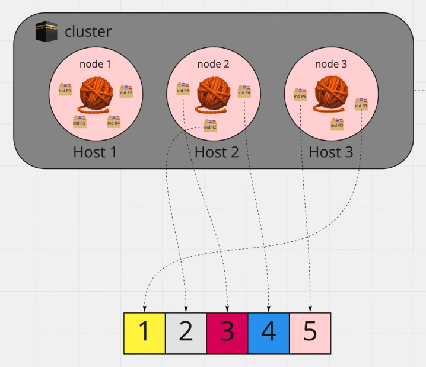

---
  tags:
    - Elasticsearch
    - Advanced
---

## Elasticsearch

[Tutorial](https://www.elastic.co/search-labs/tutorials/search-tutorial/welcome)

### Введение

Elasticsearch - поисковой движок, входящий в состав ElasticStack, набора инструментов для работы с большими объемами данных. 
Используется для хранения, поиска и обработки информации. 
Находит широкое применение в задачах, связанных с анализом логов, поиску по тексту, мониторингом систем и в системах рекомендаций.

#### Состав Elasticsearch

Elasticsearch включает в себя:

- Elasticsearch -- хранение, индексация, поиск и обработка данных;
- Kibana -- визуализация данных;
- Logstash -- централизация данных по событиям;
- Beats -- сбор и передача данных в Elasticsearch;
- X-Pack -- мониторинг, уведомления, защита.

#### Виды баз данных

Базы данных можно разделить на два основных типа, каждый из которых имеет свои особенности:

- Реляционные (SQL) -- хранят данные в формате таблиц, они строго структурированы и связаны друг с другом;
- Нереляционные (NoSQL) -- хранят данные в виде документов, где каждый документ может иметь свою структуру, 
  что обеспечивает большую гибкость и масштабируемость.

!!! note ""
    Elasticsearch относится к NoSQL базам. Хранение данных происходит с помощью JSON документов.

#### Преимущества Elasticsearch

- Горизонтальное масштабирование -- Elasticsearch легко масштабируется путем добавления новых узлов в кластер;
- Высокая производительность -- Elasticsearch обеспечивает высокую скорость поиска и индексации данных;
- Реальное время -- поддержка реального времени позволяет получать данные практически мгновенно после их индексирования;
- Гибкость запросов -- поддержка сложных запросов и агрегатов, что делает его подходящим для аналитики и бизнес-анализа;
- Поддержка полнотекстового поиска -- оптимизирован для работы с текстовыми данными, позволяя выполнять поиск по содержимому текстовых полей с учетом морфологии, синонимов и других нюансов.

!!! note ""
    Elasticsearch имеет большое количество настроек полнотекстового поиска.
    Можно учитывать опечатки, окончания, количество совпадающих слов и другое.

### Основные понятия

#### Документ

Документы -- это базовая единица информации, которая может быть проиндексирована в Elasticsearch и выражена в формате JSON.
В Elasticsearch документ может быть любые структурированные данные, закодированные в формате JSON. 
Этими данными могут быть такие вещи, как числа, строки и даты.
Например, документ может представлять собой статью энциклопедии или записи журнала веб-сервера.

Каждый документ сохраненный в индексе (`index`) имеет тип (`type`) и идентификатор (`id`).

??? note "Документ"
    ```json
    {
      "id": "UUID",
      "sort": "Ultra rare",
      "manufacturer": "Utility Factory inc.",
      "price": 700
    }
    ```

#### Индекс

В Elasticsearch индекс (`index`) -- это логическое хранилище документов, которые объединены одним смыслом.
Такое хранилище является по сути коллекцией, которая оптимизирована под поисковые запросы.
Содержимое полей документов сканируется и сохраняется в соответствующие структуры данных.



#### Узел (`node`)

Узел (или `node`) -- отдельный сервер или экземпляр Elasticsearch, который является частью кластера.
Ноды взаимодействуют между собой для хранения, обработки и поиска данных.
Они являются ключевыми компонентами, обеспечивающими распределённую природу Elasticsearch.

Назначение ноды:

- Индексация документов;
- Поиск документов;
- Агрегация документов;
- Выполнение аналитических запросов;

Один узел может выполнять несколько ролей.

#### Кластер

Кластер -- объединение одного или нескольких узлов. 
Если в кластере несколько узлов, то индексы будут распределены по этим узлам внутри кластера.

#### Фрагмент (`shard`)

Фрагмент (`shard`) -- часть индекса, распределенная по нескольким узлам в кластере.
Шарды позволяют эффективно использовать ресурсы каждой ноды: дисковое пространство и вычислительную мощность.
После создания индекса количество фрагментов изменить невозможно.



#### Репликация 

Репликация -- процесс создания копий (реплик) основных фрагментов (`shard`) на разных узлах (`node`)
для повышения доступности данных и обеспечения отказоустойчивости кластера.
